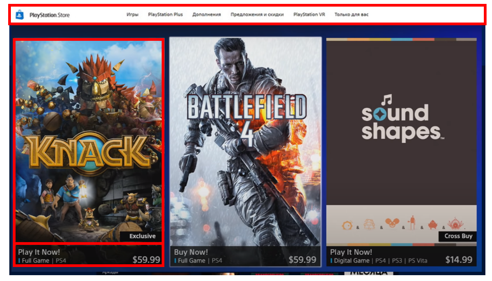
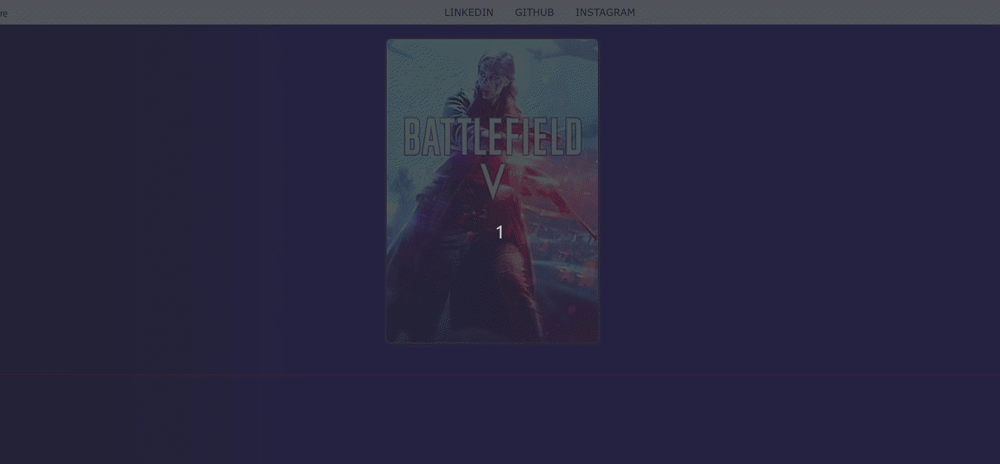

# Recriando a Interface da PlayStation Store com Angular

## Índice

- [Recriando a Interface da PlayStation Store com Angular](#recriando-a-interface-da-playstation-store-com-angular)
  - [Índice](#índice)
  - [Antes de começar](#antes-de-começar)
  - [Sobre o projeto](#sobre-o-projeto)
  - [Resultado final do projeto](#resultado-final-do-projeto)
  - [Criando a estrutura base do projeto](#criando-a-estrutura-base-do-projeto)
  - [Estudo do layout](#estudo-do-layout)
  - [Criando a base dos components](#criando-a-base-dos-components)
  - [CSS Reset](#css-reset)
  - [Gradient background](#gradient-background)
  - [Estruturando sua página](#estruturando-sua-página)
  - [Menu - Parte 1](#menu---parte-1)
  - [Menu - Parte 2](#menu---parte-2)
  - [Componente a nivel de átomo](#componente-a-nivel-de-átomo)
    - [Criando components a nível de átomo](#criando-components-a-nível-de-átomo)
    - [Estilizando o card component](#estilizando-o-card-component)
    - [Criando o label](#criando-o-label)
    - [Criando o Card Pricing](#criando-o-card-pricing)
    - [Repassando parâmetros de componentes pais para filhos](#repassando-parâmetros-de-componentes-pais-para-filhos)
  - [Dicas de refatoração](#dicas-de-refatoração)
  - [Links, referências e materiais de apoio](#links-referências-e-materiais-de-apoio)

## Antes de começar

- [x]  Criar pasta referente ao projeto
- [x]  Adicionar link da pasta nos atributos do projeto

## Sobre o projeto

Projeto criado como desafio de código do Santander Bootcamp oferecido pelo Santander e pela DIO.

Durante essa jornada vamos aprender:

- Como construir um projeto Angular
- Como pensar na criação de um projeto
- Como componentizar um layout
- Como refatorar pequenas partes do projeto
- Como organizar e dividir o projeto

O layout usado nesse curso será:

.png)

Todo o material de apoio utilizado pelo professor estará disponibilizado no Notion através [deste link](https://www.notion.so/Material-para-Aula-ab520fdd264b420387e3e6fd203f700a?pvs=21)

## Resultado final do projeto

Abaixo um vídeo de demonstração do projeto final

[Demonstração](./for_readme/kazam_vid_00000.mp4)

## Criando a estrutura base do projeto

Para iniciar vamos criar um projeto via `ng new store` dentro da pasta do projeto.

Depois nós apagamos a poluição do arquivo HTML principal e apagamos o arquivo .spec criado.

Agora criamos o serve do projeto via `ng serve` dentro da pasta raiz.

Enquanto o sistema cria a instância de servidor, podemos avaliar o layout que vamos nos basear.

O layout é composto por:

- Um menu que não dá scroll
- Um componente que pode ter informações que mudam dentro dele ( buy now, promotion, etc).

## Estudo do layout

Agora vamos avaliar o layout.

Os componentes vão ficar divididos da seguinte forma:



Assim não atomizamos demais os componentes e nem de menos, permitindo uma gestão melhor de cada coisa.

## Criando a base dos components

Para iniciar vamos criar a página que servirá de agrupador dos componentes com o comando `ng g c pages/home`

Depois criamos os componentes de menu e card via `ng g c components/menu-bar` e `ng g c components/card`

Com isso feito, adicionamos o menu e a home no HTML principal, já que não vamos trabalhar com rotas:


## CSS Reset

Agora vamos resetar as informações do CSS para que os navegadores saiam com as informações padrão.


## Gradient background

Agora vamos adicionar ao CSS global o background da aplicação.

Para isso vamos usar a ferramenta web CSS Gradient através [desse link](https://cssgradient.io/) .

Essa ferramenta nos permite criar gradientes de cores para importar no CSS depois:


Nosso CSS global ficou:


## Estruturando sua página

Agora nós criamos a estrutura básica dos componentes de home e menu-bar de forma que começamos a estilizar ambos.

No caso do home apenas colocamos um container e passamos o CSS do mesmo:

- HTML

    ```html
    <div class="home__container">
     <app-card></app-card>
    </div>
    ```

- CSS

    ```css
    .home__container{
     width: 90%;
     margin: auto;
     padding: 50px;
    
     display: flex;
     justify-content: space-around;
     align-items: baseline;
     flex-wrap: wrap;
     border: 1px solid red;
    }
    ```

No caso do menu-bar colocamos um container e os elementos que vão compor esse menu, sendo a lista com links para apontar às redes sociais:

- HTML

    ```html
    <div class="menu-bar__container">
    
     <div class="menu-bar__logo">
      
     </div>
    
     <div class="menu-bar__item">
      <ul>
       <li><a href="">Linkedin</a></li>
       <li><a href="">GitHub</a></li>
       <li><a href="">Instagram</a></li>
      </ul>
     </div>
    
    </div>
    ```

- CSS

    ```css
    .menu-bar__container{
     display: flex;
     flex-direction: row;
    
     position: fixed;
     z-index: 999;
     background-color: #fff;
    
     width: 100%;
    }
    ```

- Resultado em tela

    

## Menu - Parte 1

Agora vamos adicionar os assets baixados na estrutura de componentes do projeto.

Iniciamos adicionando o logo no menu-bar e modificando seu tamanho via CSS.

- HTML

    

- CSS

    

- Resultado em tela

    

Depois vamos adicionar uma propriedade chamada `box-shadow` no container do menu para deixar ele menos chapado na página. Essa propriedade segue a ordem horária, ou seja, cima, direita, baixo e esquerda. E depois passamos a cor.

- CSS

    

- Resultado em tela

    

Depois modificamos nosso container para a imagem do logo de forma que ele fique um pouco mais espaçado das bordas via `margin-left` e `align-items`

- CSS

    

- Resultado em tela

    

Agora modificamos o `menu-bar__item` para alinhar eles no menu.

- CSS

    

- Resultado em tela

    

## Menu - Parte 2

Nessa etapa vamos tratar o `menu-bar` para que o layout fique mais bonito e parecido com o da PSN além de adicionar aos links um apontamento para nossa rede social.

Vamos acessar o container com a `ul`, `li` e a `a` :

- HTML

    

- CSS

    

- Resultado em tela

    

Cabe notar que esse componente foi criado sem que fizessemos a atomização dele. Poderiamos criar um componente para armazenar o menu-bar e outro para armazenar os itens de menu, assim teriamos um código CSS e HTML menor.

Isso foi feito de propósito, para que o card possa ser um exemplo de um componente atomizado.

## Componente a nivel de átomo

Agora vamos iniciar a criação do card de forma atômica.

Para isso, vamos dividir o card em 3 regiões:

- div principal (container) → vai comportar todo conteúdo e terá um efeito de zoom ao passar com mouse por cima
- label de text → label que pode aparecer ou não, mostra se o jogo é exclusivo e etc
- faixa de preço → teremos uma faixa na parte de baixo do card para resumir o valor e um textinho sobre o jogo

### Criando components a nível de átomo

A ideia de componentes assim é que eles fiquem responsável por uma única parte.

Como já criamos o componente de card, precisamos criar o componente de faixa e label, mas ao invés de adicionar eles direto na pasta de componentes, vamos colocar como um subcomponente dentro da pasta `card`.

Isso porque esses dois “átomos” estão associados ao card, não faz sentido deixar eles fora.

Para criar esses dois componentes nós usamos `ng g c components/card/card-label`  e `ng g c components/card/card-pricing`essa nomenclatura dos componentes ajuda a identificar o componente pai do componente criado na hora de usar.

Dessa forma teremos a seguinte estrutura de pastas:


Após isso, a primeira coisa a ser feita é estilizar o componente principal, o `card-component` . Sempre utilizando a técnica de estruturar de cima para baixo, para ir esmiuçando.

Nesse caso, vamos adicionar uma tag `a` como container que vai embarcar todos os outros elementos do card, assim quando clicarmos em qualquer parte do card ele redireciona para o link.

- HTML

    ```html
    <a href="#" class="card__container">
     
    
    </a>
    ```

### Estilizando o card component

Agora vamos estilizar o componente principal onde ficará a imagem e os demais componentes.

Primeiro damos uma classe para a tag img e depois modificamos o CSS do card-component.

- HTML

    

- CSS

    ```css
    .card__container {
     /* Atribuindo position relative para que os outros elementos fiquem encima dele */
     position: relative;
    
     border: 3px solid #3e4357;
     border-radius: 10px;
    
     width: 350px;
     height: 500px;
    
     display: flex;
     margin-top: 10px;
    
     /* Atribuindo overflow para que todo conteúdo excedente (fora da caixa) seja escondido*/
     overflow: hidden;
    }
    
    .card__img {
     /* Independente do tamanho da imagem, ela sempre ocupara todo espaço */
     min-width: 100%;
     min-height: 100%;
    
     /* Atribuindo um tempo de transição para o eveito :hover da imagem */
     transition: transform 0.8s;
    
    }
    
    .card__img:hover {
     /* Aumentando a escala da imagem em 110% ao passar o mouse por cima */
    
     /* O aumento leva o tempo atribuido na transition */
     transform: scale(1.1);
    }
    ```

- Resultado em tela

    

### Criando o label

Agora vamos criar o label que será o texto adicionado do ladinho do card.

Como o card está com position `relative`, o label precisa estar com position `absolute` para sobrepor a imagem.

Depois de mudar isso, adicionamos alguns efeitos no CSS do `card-label` para que ele fique aparentando uma label.

Para não deixar o conteúdo do label fixo, podemos editar o arquivo TS dele adicionando o decorator `Input()` acima de uma variável que armazenará a informação do label e poderá ser modificada através de quem chamar o componente.

Dessa forma o card-label ficou:

- HTML

    ```html
    <div class="card-label__container">
     <div class="card-label__content">
      <p>{{gameLabel}}</p>
     </div>
    </div>
    ```

- CSS

    ```css
    .card-label__container {
     /* Position absolute para que ele fique na frente do componente pai que será relative */
     position: absolute;
    
     bottom: 90px;
     right: 0;
    }
    
    .card-label__content {
     background-color: #0d0d0d;
    
     display: flex;
     align-items: center;
     justify-content: center;
    
     color: white;
     font-size: 12px;
     font-family: 'Segoe UI', Tahoma, Geneva, Verdana, sans-serif;
     font-weight: bold;
    
     height: 40px;
     padding: 0px 50px;
    }
    ```

- TypeScript

    ```tsx
    import { Component, Input, OnInit } from '@angular/core';
    @Component({
     selector: 'app-card-label',
     templateUrl: './card-label.component.html',
     styleUrls: ['./card-label.component.css']
    })
    export class CardLabelComponent implements OnInit {
    
     // Cria variável para armazenar informação da label
     @Input()
     gameLabel: string = "";
    
     constructor() { }
    
     ngOnInit(): void {
     }
    
    }
    ```

Enquanto o card ficou:

- HTML

    ```html
    <a href="#" class="card__container">
     
     <app-card-label gameLabel="Digital"></app-card-label>
    
    </a>
    ```

E o resultado em tela fica da seguinte forma:


### Criando o Card Pricing

Agora vamos criar a estrutura do card-pricing.

Seguindo a mesma lógica da criação anterior, vamos fazer a estrutura em HTML e CSS para que ele apareça na frente do card pai (quem chamará ele) e depois vamos estilizar de forma que fique parecido com nosso layout modelo.

Depois tornaremos as informações dinâmicas podendo ser alteradas pelo componente que o chamar.

Sendo assim, nosso código do `card-pricing` ficará:

- HTML

    ```html
    <div class="card-pricing__container">
     <div class="card-pricing__title">
      <h3>Play it Now!</h3>
     </div>
    
     <div class="card-pricing__value">
      <div class="card-pricing__value__console">
       <span>|</span>
       <p>{{gameType}}</p>
      </div>
      <div class="card-pricing__value__money">
       <p class="game-price">{{gamePrice}}</p>
      </div>
     </div>
    </div>
    ```

- CSS

    ```tsx
    import { Component, Input, OnInit } from '@angular/core';
    
    @Component({
     selector: 'app-card-pricing',
     templateUrl: './card-pricing.component.html',
     styleUrls: ['./card-pricing.component.css']
    })
    export class CardPricingComponent implements OnInit {
    
     // Variáveis para armazenar o preço e a plataforma
     @Input()
     gameType: string = "Digital PS4";
     @Input()
     gamePrice: string = "R$ 299,90"
    
     constructor() { }
    
     ngOnInit(): void {
     }
    
    }
    ```

E nosso `card` ficará:

- HTML

    ```html
    <a href="#" class="card__container">
     
     <app-card-label gameLabel="Digital"></app-card-label>
     <app-card-pricing></app-card-pricing>
    
    </a>
    ```

Já nosso resultado em tela:


### Repassando parâmetros de componentes pais para filhos

Com esse código temos um pequeno problema, já que quem está chamando nosso card component é nossa page e o card component por sua vez chama o label e pricing.

O problema acontece na hora de passar as informações dinamicamente, pois o card component é quem está passando as informações para seus filhos:


Para que a page consiga passar a informação para o card que por sua vez passará para o label e princing, vamos refatorar o código de forma que criemos um repasse de informações.

O ideal nesse caso em que o card possui 2 componentes internos é que quem for chamar o card não conheça seus sub componentes. Ao chamar o card, o componente precisa tratar todas as informações como um único componente.

Dessa forma, vamos tornar o card component mais inteligente para ficar responsável por esse repasse e também para deixar ele mais dinâmico, já que a imagem usada de exemplo estava fixa.

Vamos começar:

Para início, modificamos o arquivo TS do card component para armazenar o caminho da imagem e deixar ela dinâmica. Depois modificamos o HTML de forma que ele receba o `src`da imagem como o valor da variável criada.

Assim, quando a page chamar esse card ela vai passar o caminho e o card vai armazenar a informação na variável e inputar no `src` do HTML.

O card foi modificado para:

- HTML

    ```html
    <a href="#" class="card__container">
     
     <app-card-label gameLabel="Digital"></app-card-label>
     <app-card-pricing gamePrice="R$ 2000,00" gameType="Digital PS5"></app-card-pricing>
    
    </a>
    ```

- TS

    ```tsx
    import { Component, Input, OnInit } from '@angular/core';
    
    @Component({
     selector: 'app-card',
     templateUrl: './card.component.html',
     styleUrls: ['./card.component.css']
    })
    export class CardComponent implements OnInit {
     // Variável para armazenar o caminho da imagem
     @Input()
     gameCover:string= "";
    
     constructor() { }
    
     ngOnInit(): void {
     }
    
    }
    ```

A home foi modificada para:

- HTML

    ```html
    <div class="home__container">
     <app-card gameCover="assets/bt-1.jpg"></app-card>
    </div>
    ```

Agora para fazer a modificação no `card` que receberá os valores e repassará para o `label` e `pricing` nós precisamos copiar as variáveis criadas dentro do arquivo TS de `label` e `pricing` no arquivo TS do card.

Assim o arquivo de TS do card ficará:

```tsx
import { Component, Input, OnInit } from '@angular/core';

@Component({
 selector: 'app-card',
 templateUrl: './card.component.html',
 styleUrls: ['./card.component.css']
})
export class CardComponent implements OnInit {
 // Variável para armazenar o caminho da imagem
 @Input()
 gameCover: string = "";

 // Cria variável para armazenar informação da label
 @Input()
 gameLabel: string = "";

 // Variáveis para armazenar o preço e a plataforma
 @Input()
 gameType: string = "Digital PS4";
 @Input()
 gamePrice: string = "R$ 299,90"

 constructor() { }

 ngOnInit(): void {
 }

}
```

Repare que é necessário copiar, não recortar!

Com isso nós vamos poder repassar as informações modificando o HTML do card, de forma que quando ele chamar os atributos dos componentes filhos ele vai passar os valores armazenados nas suas próprias variáveis de atributo.

- HTML

    ```html
    <a href="#" class="card__container">
     
     <app-card-label gameLabel="{{gameLabel}}"></app-card-label>
     <app-card-pricing gamePrice="{{gamePrice}}" gameType="{{gameType}}"></app-card-pricing>
    
    </a>
    ```

Agora no HTML do page que está chamando o card podemos inputar as informações na chamada do card:

- HTML

    ```html
    <div class="home__container">
     <app-card
     gameCover="assets/bt-1.jpg"
     gameLabel="Exclusive"
     gamePrice="R$ 229,90"
     gameType="Digital PS3"></app-card>
    
     <app-card
     gameCover="assets/bt-4.jpg"
     gameLabel="Exclusive"
     gamePrice="R$ 299,90"
     gameType="Digital PS5"></app-card>
    
     <app-card
     gameCover="assets/bt-5.jpg"
     gameLabel="Cross Buy"
     gamePrice="R$ 399,90"
     gameType="Digital PS5"></app-card>
    </div>
    ```

Com isso o resultado em tela fica:


## Dicas de refatoração

Uma dica de refatoração é que o Angular permite uma certa facilidade ao descompartimentalizar as informações.

Por exemplo, ao invés de ter todo o HTML e CSS do menu-bar nele:

- HTML

    ```html
    <div class="menu-bar__container">
    
     <div class="menu-bar__logo">
      
     </div>
    
     <div class="menu-bar__item">
      <ul>
       <li><a href="https://www.linkedin.com/in/marlonprado04/">LINKEDIN</a></li>
       <li><a href="https://github.com/marlonprado04">GITHUB</a></li>
       <li><a href="https://www.instagram.com/marlon_prado04/">INSTAGRAM</a></li>
      </ul>
     </div>
    
    </div>
    ```

- CSS

    ```css
    .menu-bar__container {
     display: flex;
     flex-direction: row;
    
     position: fixed;
     z-index: 999;
     background-color: #fff;
    
     width: 100%;
     height: 40px;
    
     box-shadow: 0px 0px 6px 0px rgba(0, 0, 0, 0.5);
    
    }
    
    .menu-bar__logo {
     margin-left: 30px;
    
     display: flex;
     align-items: center;
    }
    
    .menu-bar__logo>img {
     width: 140px;
     height: 32px;
    }
    
    .menu-bar__item {
     display: flex;
     margin: auto;
     align-items: center;
    }
    
    .menu-bar__item>ul {
     display: flex;
    
     list-style-type: none;
    }
    
    .menu-bar__item>ul>li {
     padding: 5px;
     margin-right: 15px;
    }
    
    .menu-bar__item>ul>li>a {
     padding: 5px;
    
     text-decoration: none;
     color: black;
     font-family: 'Segoe UI', Tahoma, Geneva, Verdana, sans-serif;
    }
    
    .menu-bar__item>ul>li>a:hover{
     color: blue;
     font-weight: 600;
    }
    ```

Podemos criar um componente via `ng g c components/menu-bar/menu-bar-item` para armazenar os itens do menu.

E nesse componente adicionar o HTML que representaria os itens:

- HTML

    ```html
    <div class="menu-bar-item__container">
     <ul>
      <li><a href="https://www.linkedin.com/in/marlonprado04/">LINKEDIN</a></li>
      <li><a href="https://github.com/marlonprado04">GITHUB</a></li>
      <li><a href="https://www.instagram.com/marlon_prado04/">INSTAGRAM</a></li>
     </ul>
    </div>
    ```

- CSS

    ```css
    .menu-bar-item__container{
     display: flex;
     margin: auto;
     align-items: center;
    }
    
    .menu-bar-item__container>ul {
     display: flex;
    
     list-style-type: none;
    }
    
    .menu-bar-item__container>ul>li {
     padding: 5px;
     margin-right: 15px;
    }
    
    .menu-bar-item__container>ul>li>a {
     padding: 5px;
    
     text-decoration: none;
     color: black;
     font-family: 'Segoe UI', Tahoma, Geneva, Verdana, sans-serif;
    }
    
    .menu-bar-item__container>ul>li>a:hover{
     color: blue;
     font-weight: 600;
    }
    ```

E no caso do menu-bar precisamos fazer uma pequena alteração no componente sendo chamado / css,  para que os efeitos fiquem iguais:

- HTML

    ```html
    <div class="menu-bar__container">
    
     <div class="menu-bar__logo">
      
     </div>
    
     <app-menu-bar-item class="menu-bar-item"></app-menu-bar-item>
    </div>
    ```

- CSS

    ```css
    .menu-bar__container {
     display: flex;
     flex-direction: row;
    
     position: fixed;
     z-index: 999;
     background-color: #fff;
    
     width: 100%;
     height: 40px;
    
     box-shadow: 0px 0px 6px 0px rgba(0, 0, 0, 0.5);
    
    }
    
    .menu-bar__logo {
     margin-left: 30px;
    
     display: flex;
     align-items: center;
    }
    
    .menu-bar__logo>img {
     width: 140px;
     height: 32px;
    }
    
    .menu-bar-item{
     display: flex;
     margin: auto;
     align-items: center;
    }
    ```

Com isso temos o mesmo resultado de antes.

## Links, referências e materiais de apoio

O código desenvolvido pelo professor pode ser acessado [neste link](https://github.com/felipeAguiarCode/angular-psn-store-clone)
